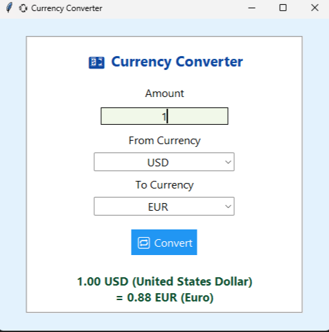

# 💱 Currency Converter 

This is a **Python desktop application** for converting currencies in Real-Time using [ExchangeRate-API](https://www.exchangerate-api.com/).  
It provides a clean and user-friendly **Tkinter-based GUI** for selecting currencies, entering amounts, and instantly getting conversion results.

---

## 🖼️ Features

- 🔁 Convert between 18 major world currencies
- 🌐 Real-time exchange rates using REST API
- 📥 Simple and clean graphical interface (built with `Tkinter`)
- 🧠 Shows full currency names alongside codes  
- ✅ Input validation and error messages

---

## 💻 Technologies Used

- `Python 3`
- `Tkinter` for GUI
- `requests` for API communication

---

## 📸 Screenshot




## 🚀 How to Run

1. Make sure you have Python 3 installed.

2. Clone this repository or download the source code:
   ```bash
   git clone https://github.com/your-username/currency-converter.git
   cd currency-converter
   ```

3. Install dependencies (if not already installed):

   ```bash
   pip install requests
   ```

4. Run the application:

   ```bash
   python main.py
   ```

---

## 🌍 Supported Currencies

* USD (United States Dollar)
* EUR (Euro)
* GBP (British Pound)
* JPY (Japanese Yen)
* CNY (Chinese Yuan)
* TRY (Turkish Lira)
* AED (UAE Dirham)
* CAD (Canadian Dollar)
* AUD (Australian Dollar)
* CHF (Swiss Franc)
* SEK (Swedish Krona)
* NOK (Norwegian Krone)
* DKK (Danish Krone)
* INR (Indian Rupee)
* RUB (Russian Ruble)
* KRW (South Korean Won)
* SGD (Singapore Dollar)
* HKD (Hong Kong Dollar)


## 📌 Notes

* API used: **ExchangeRate-API (free version)**
* Requires internet connection to fetch latest rates
* All rates are relative to the **base currency** selected by user


## 🤝 Contributing

Contributions are welcome! Feel free to fork this repo, open issues, or submit pull requests.


